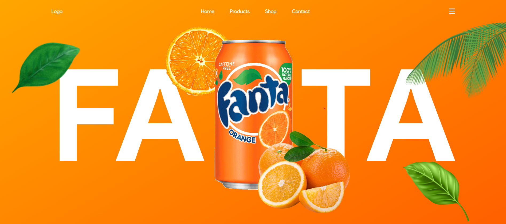

# Welcome to the Fanta Website Project

 

## Introduction

Welcome to the Fanta Website repository! This project showcases the delicious world of Fanta through a vibrant and interactive website built using HTML, CSS, and JavaScript, with animations powered by the GSAP animation library.

### Features:

1. **Interactive Design**: Engage with Fanta's refreshing brand through a dynamic and user-friendly interface.
2. **GSAP Animations**: Enjoy smooth and captivating animations crafted using the GreenSock Animation Platform.
3. **Explore Fanta Products**: Discover the wide range of Fanta flavors and products in an immersive environment.

## Installation

### To run the website locally, follow these steps:

1. **Fork this Repository**: Click the "Fork" button in the top right to create your copy of this repository.

2. **Clone Your Fork**: Using Git, clone your fork to your local machine, git clone https://github.com/yourusername/fanta-website.git

3. **Navigate to the project directory:**: cd fanta-website

4. **Open the index.html file in your preferred web browser**

### Usage:
Explore the Fanta website to learn about our products, promotions, and more! Interact with the animations to experience the fun and excitement of Fanta.

### Contributing:
We welcome contributions to enhance the Fanta website! Feel free to fork this repository, make your changes, and submit a pull request.

Happy coding! 😄
